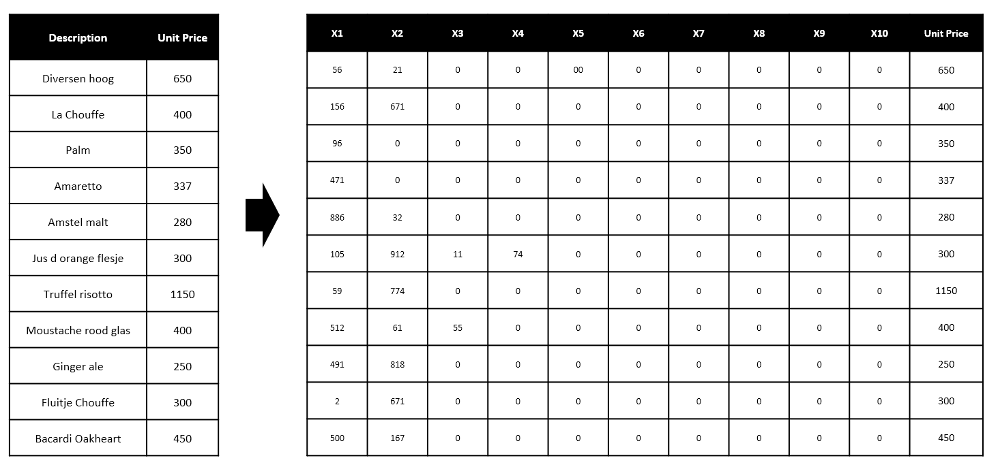
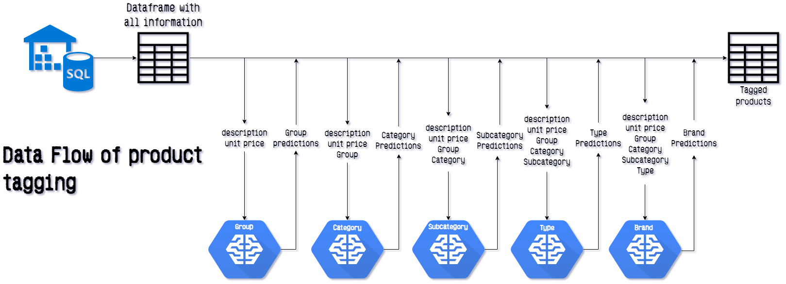
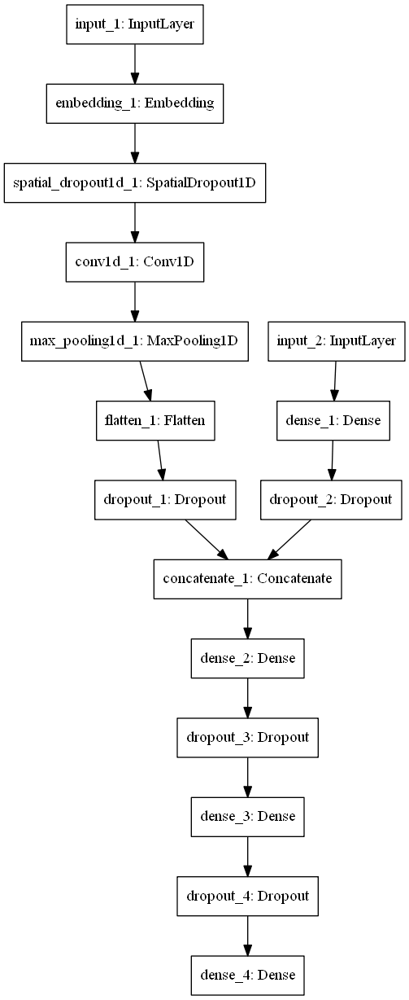

# Product Tagging in TAPP

Below is a detailed explanation of the algorithm and data flow of both the product training and prediction processes. The product tagging happens on a hierarchical basis, with a model for each level. This means there are 5 models, one for each of *group*, *category*, *subcategory*, *type* and *brand*.

Additionally, there is a evaluator script. This is a combination of the two other scripts, making predictions on the data but also evaluation it against the hand labeled data. In essence, it is very similar to the training script if all data would be used as test set. Obviously, it also doesn't train any weights.

The classification relies on unit price, description and higher order tags. The hierarchical order for the tags is `group->category->subcategory->type->brand`.
All textual data is converted to tokens. Most notably, the description is converted in a list, 11 tokens long. It is padded with zero values if it is shorter than 11 (which most are). This process is illustrated in the image below.

Just like the descriptions, the tags are also text. Difference is that with labels, we don't want to split on any characters, but map every tag to a single unique token. This has two consequences.
First, labels cannot be tokenized independently, since this will create duplicate tokens (general tokenizers start with index 0 for each tokenization). This problem can possibly be circumvented with a custom tokenizer which keeps an internal index between classification or a hash table. The hash table was just an idea, and might not actually be practical, since conversion to one-hot encoding is required.
Second, the tokenizer has a hard time parsing values with punctuation and other strange characters without splitting on them. For this reason, a cleaned version of each label is created without these characters. To make this a deterministic translation, we keep a mapping between these original tags and the cleaned tags, which is created in the training script and read from disk in the predictor.

## Below are the training and prediction script in pseudocode

### Training

1. read data from disk
2. preprocess data (add emptytoken, remove invalid rows)
3. tokenize the product descriptions
4. create a label mapping from tags to tokenizable values (``"Mouss./Vieux" -> "mouss  vieux"``)
5. create mapping from the tokenizable values to tokens (`"mouss" -> 84`)
6. **for** every classification type
   1. remove unnecessary columns
   2. add class labels
   3. remove rows with unusable data
   4. convert labels to categorical values (`84 -> [0, 0, ... , 0, 1, 0]`)
   6. split data into train and test set
   7. train model for 150 epochs with early stopping
   8. **if** plot is true, plot train and val loss
   9. evaluate on test set

### Prediction

1. read data from disk into `total_df`
2. read data tokenizer, label tokenizer and label mapping from disk
3. preprocess data (remove invalid rows)
4. tokenize the product Descriptions
5. **for** every classification type
   1. remove unnecessary columns
   2. **if** prediction type is not group
      - fill data with previously done predictions
   3. convert tags in data to numerical values
   4. remove rows with unusable data
   5. predict all data that's left
   6. add predictions to `total_df`
6. drop derived description feature columns
7. rearrange columns to ground truth and predictions are next to each other
8. write data wit predictions to disk

## Dataflow
In both processes, we use a single main data point, called `total_df`. In each classification, the required data is retrieved from this dataframe. In the prediction script, we also add predictions to `total_df`, who are then used in the next prediction. The dataflow of predictions is visualized below! The training flow is very similar, except it does **not** add predictions back to `total_df`

## Model
For these classification tasks we use a dual input, convolutional neural network. This network is implemented using Keras, since at this point that's what I was most comfortable with.

 Take a look at the image below to get a feeling of the network. Input 1 consists of the eleven description tokens and the higher level tags. Lastly, input 2 consists only of the unit price. This input is normalized to the range [0, 1] with a MinMaxScaler, saved from the training script to retain the same min-max bounds. Continue reading below this (long) image.

I won't go through the whole network, as many things speak mostly for themselves, but below I've listed some notable characteristics.

### Embedding layer
The [embedding layer](https://keras.io/layers/embeddings/) transforms the sparse input to a dense representation, by checking with what other tokens a certain token is seen often. This result is transformed to a vector of a certain length (128 in our case). This vector is unique for each token, and is saved with the weights. This transformation is comparable to the [Word2Vec](https://en.wikipedia.org/wiki/Word2vec) from Google. The output of the embedding layer is input for the LSTM layers. There are two embedding layers in this network. One for the description tokens and one for the tag tokens.

### Spatial Dropout
Whereas normal dropout removes activations from a single neuron, [spatial dropout](https://keras.io/layers/core/#spatialdropout1d) removes activations from a whole 1D feature set; in this case, the word embeddings of a word. The effect of this measure is that it will reduce inter word correlation.

### 1D Convolutional
[1D convolutions](https://keras.io/layers/convolutional/#conv1D) convolve over the feature maps of a 1D input. This means the convolution is done looking at the word before and after a certain word, but rather than looking at the words themselves, the model looks at the word embeddings. The word embeddings themselves are a vector of length 64.

### Concatenate layer
To get a single prediction in the end while still considering all the data, the three intermediate data representations are concatenated using a [concatenate layer](https://keras.io/layers/merge/#concatenate). This is then propagated into a single dense layer for further analysis.

### Last Dense layer
The last layer does the actual prediction using softmax. The previously mentioned restraint of a single tokenizer for the classes means this network in every setting has 1400 classes. Due to training, it will always predict a class specifically for that tag level. For example, when predicting groups it still has 1400 possible class outputs, but since 1396 are never seen in the train set, these will never be predicted.

## Results
The test set accuracy of the model for the five tasks is as follows:

| task      | accuracy |
|-----------|----------|
|group        | 0.9463 |
|category     | 0.9798 |
| subcategory | 0.9738 |
| type        | 0.9513 |
| brand       | 0.9381 |

The evaluation details can be found in `product_classification/evaluation`. These results are from the whole set, not just the testset.

## Training on AWS
For automated retraining of the network we use AWS Batch. Since access to the GPU requires some differences compared to normal, these are explained below.
For using the GPU, we need an EC2 instance with a GPU. The P2.xlarge was chosen for this task, having a NVIDIA k80 GPU. To access the gpu, we need drivers. Since many people want to use this, Amazon
has provided some default AMI's (Amazon Machine Images), which are the VM's amazon uses for their hardware. We use the Deep Learning AMI with Linux (other options are ubuntu and windows, but we need Linux voor ecs access).

This AMI is edited by the steps outlined in the following [tutorial](https://docs.aws.amazon.com/batch/latest/userguide/batch-gpu-ami.html), of which mainly the bash script is relevant. This script sets the NVIDIA runtime as default for docker.
This allows us to use the GPU in docker containers.
